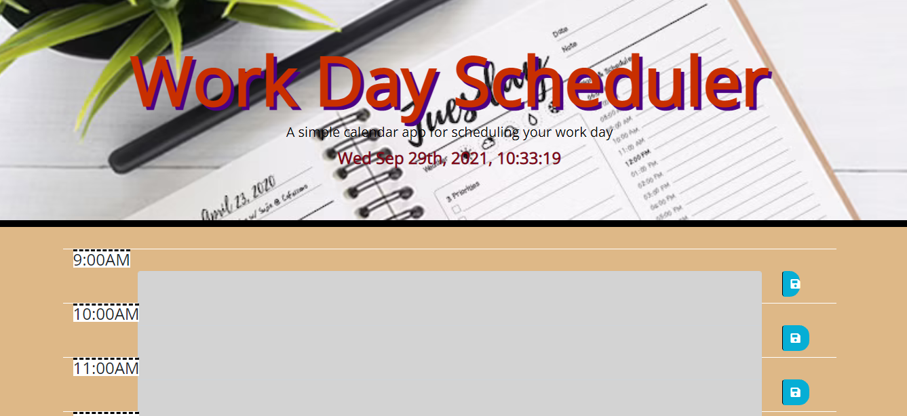

# Homework 5: Day Planner

The purpose of this assignment is to make a functional day planner.

## Link: https://cathytanya.github.io/planner/

## Criteria

- When I open the planner, then the current day is displayedd at the top of the calender  
- When I scroll down, then I am presented with time blocks forr standard business  
- When I newi the timeblocks for that day, then each timeblock is colour coded to indicate whether it is in the past, present, or future
- When I click the save button for that time block, then the text for that event is saved in local storage
- When I refresh the page, then the saved events persist

## Issues
- The local storage is not saving the information in the text box.
- When the refresh button is pressed, the content in the save button is not being saved

## Page Screenshot:

 
